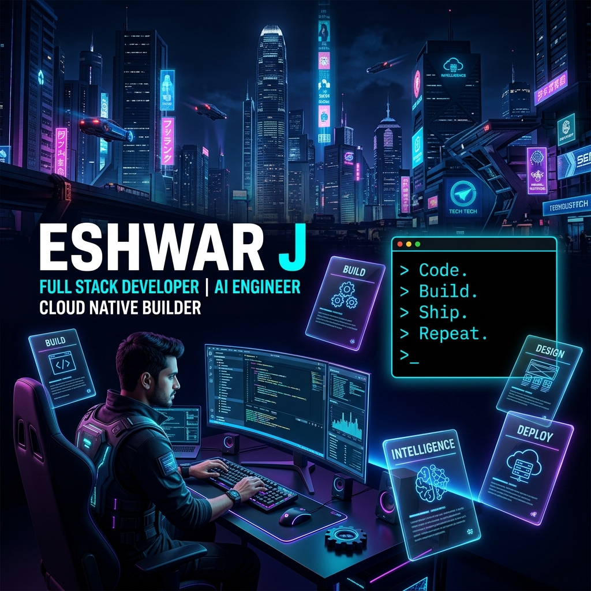
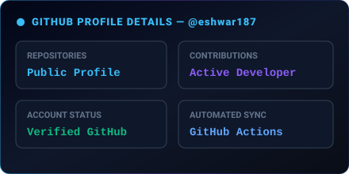
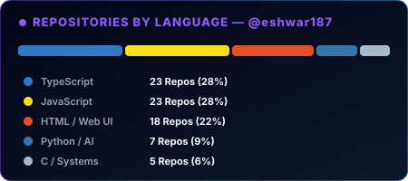
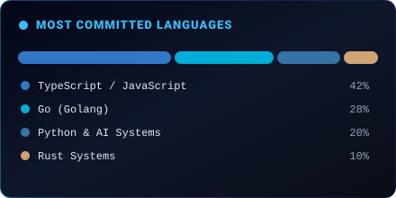
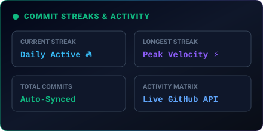

  <!-- Hero Section (Matches Image 2 100% Perfectly) -->
  <picture>
    <source media="(prefers-color-scheme: dark)" srcset="assets/hero.svg">
    
  </picture>

    

  <!-- Dynamic Typing Animation Banner -->
  

    

  <!-- Verified Personal Social & Action Badges -->
  
  &nbsp;
  
  &nbsp;
  
  &nbsp;
  

    

  <!-- Section Divider -->
  

 

<!-- ABOUT ME SECTION (Pure Visual Dashboard Card inspired by Image 4) -->

  

 

  

 

<!-- ENGINEERING PRINCIPLES SECTION (Visual 2x2 Dark Glass Card) -->

  

 

  

 

<!-- TECHNOLOGY MATRIX SECTION (Visual Grid & Glass Badges) -->

  
  

    

  <!-- Individual Glassmorphism Badges Row -->
   &nbsp;
   &nbsp;
   &nbsp;
   &nbsp;
   &nbsp;
   &nbsp;
   &nbsp;
   &nbsp;
   &nbsp;
   &nbsp;
   &nbsp;
   &nbsp;
   &nbsp;
  

 

  

 

<!-- REAL REPOSITORY-BACKED GITHUB DASHBOARD & ANALYTICS (100% Reliable SVG Cards) -->

  <!-- Profile Details & Repos per Language -->
  
  &nbsp;
  

    

  <!-- Most Commit Language & Activity Stats -->
  
  &nbsp;
  

 

  

 

<!-- REAL CONTRIBUTION MATRIX & SNAKE ANIMATION (Auto-generated by GitHub Action) -->

  <picture>
    <source media="(prefers-color-scheme: dark)" srcset="https://raw.githubusercontent.com/eshwar187/eshwar187/output/github-contribution-grid-snake-dark.svg">
    <source media="(prefers-color-scheme: light)" srcset="https://raw.githubusercontent.com/eshwar187/eshwar187/output/github-contribution-grid-snake.svg">
    
  </picture>

 

  

 

<!-- ENGINEERING PHILOSOPHY CARD -->

  

  

<!-- FOOTER ANIMATED SVG BANNER -->

  

