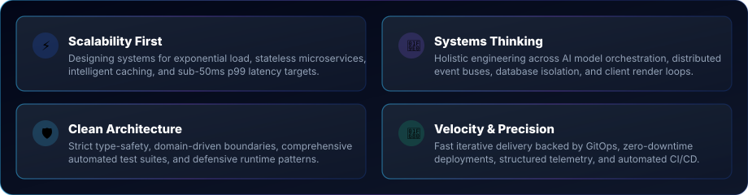
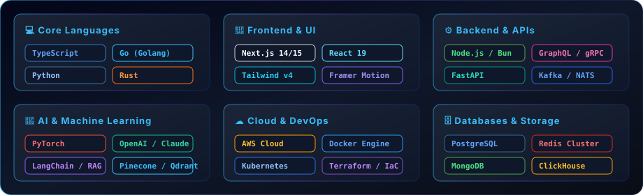
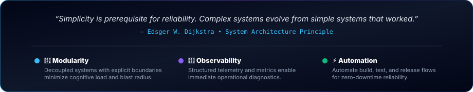
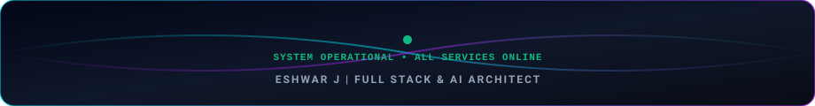

# 🎨 Design Assets & Visual Showcase — `eshwar187`

This repository features a custom design system inspired by **Apple, Stripe, Vercel, Linear, Supabase, Raycast, and OpenAI**.

---

## 🚀 1. Hero Banner (`assets/hero.svg`)
Top-tier cyberpunk vector graphic featuring large glowing **ESHWAR J** typography, subheader (`AI ENGINEER | CLOUD NATIVE BUILDER | PROBLEM SOLVER`), floating feature cards (*BUILD*, *DESIGN*, *INTELLIGENCE*, *DEPLOY*), terminal window (`> Code. > Build. > Ship. > Repeat.`), and tech pillar chips.

---

## 💻 2. About Me Visual Dashboard Card (`assets/about.svg`)
Top-notch pure visual animated dashboard card showcasing architectural capabilities (*AI Agent Architecture*, *High-Throughput Microservices*, *Cloud Native Infrastructure*, *Modern Reactive Interfaces*).

---

## 🎯 3. Engineering Principles Card (`assets/principles.svg`)
Sleek 2x2 dark glass grid card showcasing core engineering principles.

---

## 🛠️ 4. Technology Stack Matrix (`assets/tech-matrix.svg`)
Bespoke Vercel/Supabase-style dark glass tech stack matrix card.

---

## 💭 5. Engineering Philosophy Card (`assets/philosophy.svg`)
Custom quote and architecture pillar card.

---

## ⚡ 6. Section Divider (`assets/divider.svg`)
Glowing neon accent line with center diamond node.

---

## 🛡️ 7. Glassmorphism Badges (`assets/badges/`)

| Technology | Badge Asset |
| :--- | :--- |
| **Python** |  |
| **TypeScript** |  |
| **React** |  |
| **Next.js** |  |
| **Node.js** |  |
| **Go** |  |
| **Rust** |  |
| **PostgreSQL** |  |
| **Docker** |  |
| **AWS** |  |
| **PyTorch** |  |
| **Kubernetes** |  |
| **Tailwind CSS** |  |
| **GraphQL** |  |

---

## ⚓ 8. Footer Banner (`assets/footer.svg`)
Animated footer asset with glowing sine waves and drift particles.

