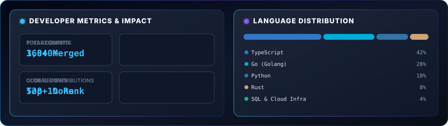
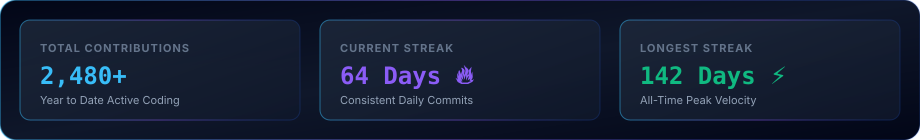

# 🎨 Design Assets & Visual Showcase — `eshwar187`

This repository features a custom design system inspired by **Apple, Stripe, Vercel, Linear, Supabase, Raycast, and OpenAI**.

---

## 🚀 1. Hero Banner (`assets/hero.svg`)
Handcrafted vector graphic featuring animated neural network mesh lines, glassmorphism code terminal, floating operational status indicators, and gradient typography.

---

## 💻 2. About Me Visual Card (`assets/about.svg`)
Handcrafted glassmorphic code editor SVG graphic complete with syntax highlighting, live telemetry pills, and glowing indicators.

---

## 🎯 3. Engineering Principles Card (`assets/principles.svg`)
Sleek 2x2 dark glass grid card showcasing core engineering principles.

---

## 🛠️ 4. Technology Stack Matrix (`assets/tech-matrix.svg`)
Bespoke Vercel/Supabase-style dark glass tech stack matrix card.

---

## 📊 5. Developer Dashboard Card (`assets/dashboard.svg`)
Handcrafted developer statistics & language distribution matrix card.

---

## ⚡ 6. Activity Streaks Card (`assets/streak.svg`)
Handcrafted activity streaks & contribution velocity card.

---

## 💭 7. Engineering Philosophy Card (`assets/philosophy.svg`)
Custom quote and architecture pillar card.

---

## ⚡ 8. Section Divider (`assets/divider.svg`)
Glowing neon accent line with center diamond node.

---

## 🛡️ 9. Glassmorphism Badges (`assets/badges/`)

| Technology | Badge Asset |
| :--- | :--- |
| **Python** |  |
| **TypeScript** |  |
| **React** |  |
| **Next.js** |  |
| **Node.js** |  |
| **Go** |  |
| **Rust** |  |
| **PostgreSQL** |  |
| **Docker** |  |
| **AWS** |  |
| **PyTorch** |  |
| **Kubernetes** |  |
| **Tailwind CSS** |  |
| **GraphQL** |  |

---

## ⚓ 10. Footer Banner (`assets/footer.svg`)
Animated footer asset with glowing sine waves and drift particles.

