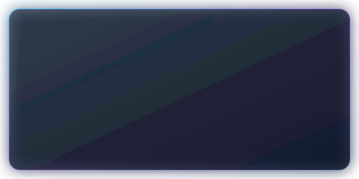
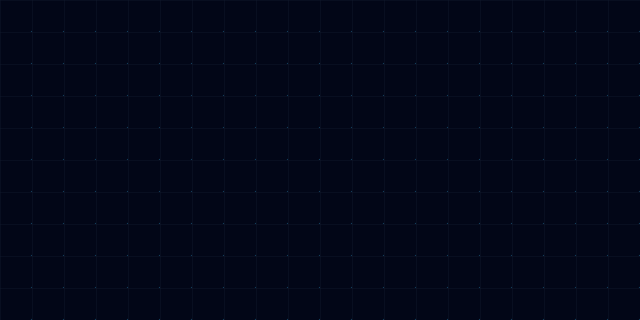

# 🎨 Design Assets & Visual Showcase — `eshwar187`

This repository features a custom design system inspired by **Apple, Stripe, Vercel, Linear, Supabase, Raycast, and OpenAI**.

---

## 🚀 Hero Section (`assets/hero.svg`)
Handcrafted vector graphic featuring animated neural network mesh lines, glassmorphism code terminal, floating operational status indicators, and gradient typography.

---

## ⚡ Section Divider (`assets/divider.svg`)
Glowing neon accent line with center diamond node connecting content sections.

---

## 🎴 Glassmorphic Card Frame (`assets/glass-card.svg`)
Reusable glass-style backdrop element with cyan/purple gradient border opacity.

---

## 🌐 Backdrop Grid & Background (`assets/grid.svg` & `assets/background.svg`)
Cyberpunk ambient glow backdrops for high-contrast presentation.

| Grid Backdrop | Ambient Glow |
| :---: | :---: |
|  |  |

---

## 🛡️ Glassmorphism Badges (`assets/badges/`)

| Technology | Badge Asset |
| :--- | :--- |
| **Python** |  |
| **TypeScript** |  |
| **React** |  |
| **Next.js** |  |
| **Node.js** |  |
| **Go** |  |
| **Rust** |  |
| **PostgreSQL** |  |
| **Docker** |  |
| **AWS** |  |
| **PyTorch** |  |
| **Kubernetes** |  |
| **Tailwind CSS** |  |
| **GraphQL** |  |

---

## ⚓ Footer Banner (`assets/footer.svg`)
Animated footer asset with glowing sine waves and drift particles.

